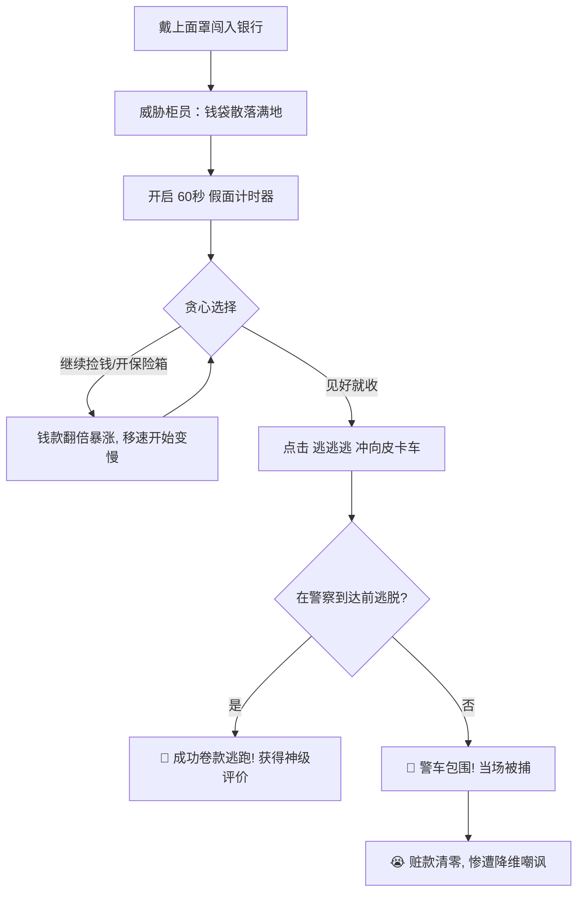

# 🎮 《一分钟劫匪》 | One Minute Heist
### 🚀 2026年黑客松（Hackathon）极限24小时参赛项目

---

## 🌟 重磅看点：12岁天才小极客与10岁妹妹的“神仙组合”

在强手如云、高手汇聚的黑客松（Hackathon）大赛现场，有一个最特别、最瞩目的开发团队：**一位12岁的哥哥，带着他10岁的妹妹，在极限的24小时内，从零开始打磨并交付了这款拥有极致视觉、丰富音效以及魔性博弈机制的网页游戏——《一分钟劫匪》！**

*   **哥哥（12岁）· 主程序员 & 架构师**：负责游戏核心框架搭建、Phaser 3 引擎渲染管线、物理与碰撞判定、倒计时博弈算法、双端适配（PC端高清二维码生成）等核心系统。
*   **妹妹（10岁）· 关卡策划、美术设计 & 音效总监**：负责巧妙利用AI工具生成与精选像素风素材、设计数值翻倍平衡性曲线、配置五个核心保险箱的奖励倍数，更是亲自献声录制了劫匪入场时那几句霸气又好玩的配音！

他们用不可思议的默契与编程天赋，证明了“热爱与创意无关年龄”。在短短24小时内，他们克服了素材处理、设备适配、倒计时精度校准等多重技术大关，完成了这款令人惊艳的像素艺术作品！

---

## 🎮 游戏核心玩法与创意机制

> 💡 **“贪婪与理性的终极较量，这辈子就赌这一把！”**

《一分钟劫匪》并不是一款简单的“捡钱游戏”，而是一场针对人性弱点（贪婪）的心理博弈战。

### 1. 致命的随机潜伏期（55s ~ 65s）
游戏界面中央上方会显示一个刺眼的 **60.0s** 倒计时。但请记住，**这只是一个幌子！** 
真实世界里警察赶到现场的时间是在 **55秒 到 65秒** 之间随机波动的！你可能在第56秒就听到警笛大作被当场拿下，也可能在第64秒涉险过关。这种不可预测性，让每一次点击都伴随着心跳加速的刺激感。

### 2. 疯狂累加的翻倍成长线
满地钱袋和神秘保险箱绝非凡物，它们拥有极具杀伤力的**数值翻倍乘数**：
*   **棕色钱袋**：基础赏金 `+$20`。
*   **深色/绿色/金色钱袋**：分别提供 `x2`、`x2.5`、`x3` 的恐怖连击乘数！
*   **超级保险箱（五个特定点位）**：
    *   **左上角保险箱**：`x5` 翻倍
    *   **右上角按钮保险箱**：`x15` 翻倍
    *   **中间旋转式保险箱**：`x20` 翻倍
    *   **左下角指纹保险箱**：`x35` 翻倍
    *   **右下角密码式保险箱**：**直接拉满到惊人的 `x40` 翻倍！**

只要你的手够快，你的财富将在几十秒内呈几何级数爆炸增长！

### 3. “猪队友”与主角的心路独白
*   站在门口把风的**胖子劫匪同伙（妹妹配音）**会在报警的瞬间急促大喊：`🚨 完了！报警了！！`
*   而主角在捡钱的过程中，会随着钱袋数量增加，不断冒出让人捧腹的内心OS：
    *   捡到3袋：`嘿嘿嘿 真香！`
    *   捡到14袋：`贪心？我这叫专业！`
    *   捡到18袋：`我是不是有点上头了…`
    *   捡到40袋：`老婆对不起…但这钱太多了！`
    *   捡到50袋：`我已经无法停下来了…`

### 4. 让人捶胸顿足的“神仙判定”
*   **【成功逃脱】**：在警察赶到前，控制劫匪以 1.5 倍的逃跑速度冲回门外的皮卡车，点击“逃逃逃”！系统会根据你距离警察到达时间的零界点，给予不同的炫酷称号（如：**千钧一发！**、**惊险逃脱！**、**游刃有余**）。
*   **【惨遭逮捕】**：如果贪恋最后那一袋金子而超时，屏幕将被警笛红蓝光刺眼笼罩，大批警车呼啸而来！你将面临 **$0 颗粒无收** 的惨局。最魔性的是，结算卡片上会无情地显示一行大字：
    > 😭 **“如果你少抢 1袋钱，你本可以带走 $X,XXX,XXX 元！”**
    
    这种直击灵魂的遗憾感，会瞬间激发玩家“再来一局”的强烈胜负欲！

---

## 🛠️ 技术亮点与极简架构

在这个24小时极限项目中，两位创作者以极为精炼、实用的方案实现了卓越的前端交互：

| 维度 | 所用技术 | 作用与亮点 |
| :--- | :--- | :--- |
| **游戏引擎** | **Phaser v3.80.0** | 完美的像素艺术（Pixel Art）渲染模式，高效稳定地控制 50+ 精灵的动作与画面粒子效果。 |
| **自适应布局** | **双端响应式全屏模式** | 支持 PC 桌面端侧边栏动态生成二维码扫码游玩，同时完美兼容手机浏览器多点触控操作。 |

---

## 🔗 官方畅玩入口

为了让更多人体验到这款在黑客松中诞生的杰作，哥哥将游戏部署到了个人门户中，欢迎大家一键畅玩！

### 🎮 游戏在线体验
*   **官方唯一指定入口**： 👉 [k165.com](http://k165.com) 👈
    *(建议使用手机浏览器直接打开，或者在 PC 端打开后，扫描右上角二维码，体验最佳的操作手感！)*

---

## 🎨 像素艺术与音效打磨 (妹妹的杰作)

*   **视觉饕餮**：
    *   主角抢匪拥有细腻的**正面、背面、左侧面行走动画**。根据摇杆移动方向自动翻转与切换，告别生硬的平移。
    *   银行内部发光的防盗金库、柜员举手投降的发抖动画、警车闪烁的探照灯以及胜利后满屏飞舞的钞票雨，细节之处见真章。
*   **声临其境**：
    *   **启动页**：警笛长鸣与重金属风的启动音轨（`启动页.mp3`），瞬间将玩家带入犯罪大片的紧张氛围。
    *   **抢劫中**：动感十足、鼓点密集的 `开始抢银行.mp3` 背景乐，让人忍不住随着节奏疯狂点击。
    *   **金币音效**：捡钱时，音效会加入随机音调偏移（detune），模拟出把真金白银哗啦啦倒进口袋的丰富层次感。

---

## 🏆 结语：黑客精神的完美诠释

编程不仅仅是代码的堆砌，更是灵感的具象化。在这场 24 小时的黑客松挑战中，12 岁的哥哥用扎实的代码逻辑筑起了地基，10 岁的妹妹用天马行空的想象力为大厦刷上了最绚丽的色彩。

《一分钟劫匪》是他们送给所有喜爱游戏、喜爱编程的朋友们最好的礼物。

立刻打开 [k165.com](http://k165.com)，进入这家充满疯狂连击的像素银行，和警车进行一场生死的赛跑吧！

---
*版权所有 © 2026 12岁哥哥&10岁妹妹黑客松极客工坊。保留所有权利。*
